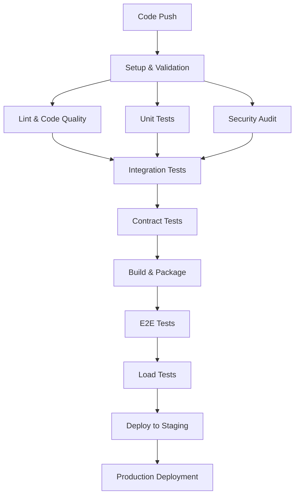

# PBCEx Testing Plan & Strategy

## Overview

This document outlines the comprehensive testing strategy for the People's Bank & Commodities Exchange (PBCEx) platform, covering all aspects from unit testing to end-to-end validation, security audits, and A/B experimentation.

## Table of Contents

1. [Testing Philosophy](#testing-philosophy)
2. [Test Environments](#test-environments)
3. [Functional API Testing](#functional-api-testing)
4. [Feature Flag Validation](#feature-flag-validation)
5. [A/B Experiment Testing](#ab-experiment-testing)
6. [Performance Testing](#performance-testing)
7. [Security Testing](#security-testing)
8. [End-to-End Testing](#end-to-end-testing)
9. [Contract Testing](#contract-testing)
10. [Rollback & Recovery Plan](#rollback--recovery-plan)
11. [CI/CD Integration](#cicd-integration)
12. [Test Data Management](#test-data-management)
13. [Monitoring & Alerting](#monitoring--alerting)

---

## Testing Philosophy

### Core Principles

- **Shift Left**: Catch issues early in the development cycle
- **Test Pyramid**: Heavy unit testing, moderate integration, focused E2E
- **Risk-Based**: Prioritize testing based on business impact and failure probability
- **Continuous**: Testing is integrated into every stage of development
- **Data-Driven**: Use real-world scenarios and data patterns
- **Privacy First**: All test data must be synthetic and GDPR compliant

### Test Types & Scope

| Test Type | Coverage | Tools | Frequency |
|-----------|----------|-------|-----------|
| Unit | 90%+ | Jest | Every commit |
| Integration | Critical paths | Supertest + Jest | Every PR |
| Contract | All API endpoints | Dredd + OpenAPI | Every PR |
| E2E | Core user journeys | Playwright | Nightly/Release |
| Load | Performance SLAs | k6 | Weekly/Release |
| Security | OWASP Top 10 | Custom audit script | Weekly |
| A/B | Experiment integrity | Custom framework | Every experiment |

---

## Test Environments

### Environment Strategy

```
Development → Testing → Staging → Production
     ↓           ↓         ↓           ↓
   Local DB   Test DB   Stage DB   Prod DB
     ↓           ↓         ↓           ↓
  Mock APIs  Stub APIs  Real APIs  Real APIs
```

### Environment Configuration

#### Development (`NODE_ENV=development`)
- Local PostgreSQL database
- Redis for caching
- Mock external services (Stripe, Plaid, etc.)
- Debug logging enabled
- Hot reloading active

#### Testing (`NODE_ENV=test`)
- Dedicated test database (`pbcex_test`)
- In-memory Redis for speed
- Stubbed external services
- Minimal logging
- Deterministic test data

#### Staging (`NODE_ENV=staging`)
- Production-like database
- Real Redis cluster
- External service sandbox/test modes
- Full feature flags enabled
- Performance monitoring active

#### Production (`NODE_ENV=production`)
- Production database with read replicas
- Redis cluster with failover
- Live external services
- Conservative feature flags
- Full observability stack

---

## Functional API Testing

### API Endpoint Checklist

#### ✅ Core MVP Endpoints

| Endpoint | Method | Auth | Status | Tests |
|----------|--------|------|--------|-------|
| `/health` | GET | None | ✅ Active | Health check, service status |
| `/api/auth/register` | POST | None | ✅ Active | Registration flow, validation |
| `/api/auth/login` | POST | None | ✅ Active | Login flow, JWT generation |
| `/api/auth/logout` | POST | JWT | ✅ Active | Session termination |
| `/api/auth/me` | GET | JWT | ✅ Active | Profile retrieval |
| `/api/kyc/submit` | POST | JWT | ✅ Active | KYC submission, validation |
| `/api/kyc/status` | GET | JWT | ✅ Active | KYC status tracking |
| `/api/wallet/balances` | GET | JWT | ✅ Active | Balance retrieval |
| `/api/wallet/transfer` | POST | JWT | ✅ Active | Internal transfers |
| `/api/trade/prices` | GET | JWT | ✅ Active | Price feed, spread calculation |
| `/api/trade/order` | POST | JWT | ✅ Active | Trade execution |
| `/api/trade/history` | GET | JWT | ✅ Active | Trade history |
| `/api/shop/products` | GET | None | ✅ Active | Product catalog |
| `/api/shop/quote` | POST | JWT | ✅ Active | Price locking |
| `/api/shop/checkout` | POST | JWT | ✅ Active | Order processing |
| `/api/admin/exposure` | GET | Admin | ✅ Active | Risk management |

#### 🧪 Phase-3 Endpoints (Feature Flagged)

| Endpoint | Method | Auth | Flag | Tests |
|----------|--------|------|------|-------|
| `/api/redeem` | POST | JWT | `ENABLE_VAULT_REDEMPTION` | Redemption requests |
| `/api/redeem/status/{id}` | GET | JWT | `ENABLE_VAULT_REDEMPTION` | Status tracking |
| `/api/redeem/quote` | GET | JWT | `ENABLE_VAULT_REDEMPTION` | Pricing quotes |
| `/api/vault/inventory` | GET | Admin | `ENABLE_VAULT_REDEMPTION` | Inventory management |
| `/api/vault/inventory/restock` | POST | Admin | `ENABLE_VAULT_REDEMPTION` | Stock replenishment |
| `/api/vault/redemptions/{id}/approve` | POST | Admin | `ENABLE_VAULT_REDEMPTION` | Approval workflow |
| `/api/vault/redemptions/{id}/ship` | POST | Admin | `ENABLE_VAULT_REDEMPTION` | Shipping updates |
| `/api/support/user/{id}` | GET | Support | Always | User management |
| `/api/support/search` | GET | Support | Always | User search |
| `/api/support/user/{id}/reset-password` | POST | Support | Always | Password reset |
| `/api/support/order/{id}/adjust` | POST | Support | Always | Order adjustments |

#### 🎯 Analytics Endpoints

| Endpoint | Method | Auth | Purpose | Tests |
|----------|--------|------|---------|-------|
| `/api/analytics/event` | POST | JWT | Single event logging | Event validation, PII redaction |
| `/api/analytics/events` | POST | JWT | Batch event logging | Batch processing, rate limiting |
| `/api/analytics/experiments/assignments` | GET | JWT | A/B assignments | Experiment integrity |
| `/api/analytics/experiments/assign` | POST | JWT | Variant assignment | Hash consistency |
| `/api/analytics/performance` | POST | JWT | Performance metrics | Metric validation |
| `/api/analytics/business-metric` | POST | JWT | Business KPIs | Data accuracy |
| `/api/analytics/error` | POST | JWT | Error logging | Error categorization |

### Test Execution Commands

```bash
# Full API test suite
npm run test:api

# Specific endpoint group
npm run test:api -- --grep "auth"
npm run test:api -- --grep "trade"
npm run test:api -- --grep "admin"

# Feature flag specific tests
ENABLE_VAULT_REDEMPTION=true npm run test:api -- --grep "redeem"
FULFILLMENT_STRATEGY=BRINKS npm run test:api -- --grep "fulfillment"

# Contract validation
npm run test:contract

# API documentation validation
npm run validate:openapi
```

---

## Feature Flag Validation

### Flag Configuration Matrix

| Flag | Default | Purpose | Test Scenarios |
|------|---------|---------|----------------|
| `PHASE` | `1` | Feature phases | 1→2→3 progression testing |
| `ENABLE_ONCHAIN` | `false` | L2/L1 integration | Blockchain connectivity |
| `ENABLE_VAULT_REDEMPTION` | `false` | Physical redemption | 501 vs success responses |
| `FULFILLMENT_STRATEGY` | `JM` | Fulfillment provider | JM vs BRINKS routing |

### Feature Flag Test Matrix

#### Redemption Feature Tests

```bash
# Test disabled state (should return 501)
ENABLE_VAULT_REDEMPTION=false npm test tests/integration/api/flags.api.test.ts

# Test enabled state (should process request)
ENABLE_VAULT_REDEMPTION=true npm test tests/integration/api/flags.api.test.ts

# Test fulfillment strategy switching
FULFILLMENT_STRATEGY=JM npm test tests/unit/fulfillment.test.ts
FULFILLMENT_STRATEGY=BRINKS npm test tests/unit/fulfillment.test.ts
```

#### Phase Progression Tests

```bash
# MVP behavior (Phase 1)
PHASE=1 npm test -- --grep "phase"

# Enhanced features (Phase 2)
PHASE=2 npm test -- --grep "phase"

# Full feature set (Phase 3)
PHASE=3 ENABLE_VAULT_REDEMPTION=true npm test -- --grep "phase"
```

### Feature Flag Validation Checklist

- [ ] **Default State**: All new features OFF by default
- [ ] **Backward Compatibility**: Phase 1 behavior unchanged when flags disabled
- [ ] **Graceful Degradation**: Proper 501 responses for disabled endpoints
- [ ] **Configuration Validation**: Invalid flag values rejected with clear errors
- [ ] **Runtime Toggle**: Flags changeable without application restart
- [ ] **Audit Trail**: Flag changes logged for compliance
- [ ] **Rollback Safety**: Instant disable capability for emergency rollbacks

---

## A/B Experiment Testing

### Experiment Integrity Validation

#### Hash Distribution Tests

```javascript
// Validate 50/50 split
const assignments = {};
for (let i = 0; i < 10000; i++) {
  const userId = `user_${i}`;
  const variant = ExperimentService.assignVariant(userId, 'test_experiment');
  assignments[variant] = (assignments[variant] || 0) + 1;
}

// Should be approximately 5000/5000 (±2% tolerance)
expect(Math.abs(assignments.control - assignments.treatment)).toBeLessThan(200);
```

#### Consistency Tests

```javascript
// Same user should always get same variant
const userId = 'consistent_user';
const variant1 = ExperimentService.assignVariant(userId, 'test_experiment');
const variant2 = ExperimentService.assignVariant(userId, 'test_experiment');
expect(variant1).toBe(variant2);
```

#### Traffic Allocation Tests

```javascript
// Test custom traffic allocation [70, 30]
const results = testAllocation('custom_experiment', ['control', 'treatment'], [70, 30]);
expect(results.control).toBeCloseTo(7000, 100); // ±1% tolerance
expect(results.treatment).toBeCloseTo(3000, 100);
```

### Active Experiments (As of Implementation)

| Experiment | Variants | Traffic Split | Location | Metrics |
|------------|----------|---------------|----------|---------|
| `onboarding_form_length` | multi_step, single_page | 50/50 | Registration | Conversion rate, time to complete |
| `order_form_layout` | standard, compact | 70/30 | Trading | Order completion, user satisfaction |
| `spread_hint_tooltip` | show, hide | 50/50 | Trading | Help engagement, confusion reduction |
| `checkout_flow_steps` | streamlined, detailed | 40/60 | Shop | Cart abandonment, order success |
| `price_refresh_frequency` | fast_5s, standard_10s, slow_30s | 20/60/20 | Trading | User engagement, server load |

### Experiment Testing Commands

```bash
# Test experiment assignment consistency
npm test tests/unit/experimentService.test.ts

# Test analytics integration
npm test tests/integration/api/analytics.api.test.ts

# Test frontend experiment utilities
cd frontend && npm test utils/experiment.test.ts

# Validate experiment configuration
npm run validate:experiments
```

### A/B Test Checklist

- [ ] **Consistent Assignment**: Same user always gets same variant
- [ ] **Proper Distribution**: Traffic splits within ±2% tolerance
- [ ] **Analytics Integration**: All events properly logged
- [ ] **Feature Integration**: Variants correctly applied in UI/logic
- [ ] **Rollback Capability**: Can disable experiment instantly
- [ ] **Statistical Significance**: Minimum sample size calculated
- [ ] **Ethical Considerations**: No harm to user experience
- [ ] **Performance Impact**: No measurable performance degradation

---

## Performance Testing

### Performance Targets & SLAs

#### Response Time Targets (95th percentile)

| Endpoint Category | Target | Acceptable | Critical |
|-------------------|--------|------------|----------|
| Authentication | < 200ms | < 500ms | < 1000ms |
| Price Feeds | < 100ms | < 250ms | < 500ms |
| Trading Operations | < 300ms | < 750ms | < 1500ms |
| Shop/Checkout | < 400ms | < 1000ms | < 2000ms |
| Admin Operations | < 500ms | < 1250ms | < 2500ms |
| Analytics/Logging | < 50ms | < 150ms | < 300ms |

#### Throughput Targets

| Operation | Target RPS | Peak RPS | Concurrent Users |
|-----------|------------|----------|------------------|
| Price Polling | 1000 | 2500 | 5000 |
| Trade Orders | 100 | 250 | 500 |
| User Authentication | 50 | 125 | 250 |
| Shop Browsing | 500 | 1250 | 2500 |
| Admin Operations | 20 | 50 | 25 |

### Load Testing Scenarios

#### Trade Order Load Test (`trade_order.js`)

```bash
# Light load test (development)
k6 run --vus 10 --duration 30s loadtests/k6/scenarios/trade_order.js

# Performance validation (CI)
k6 run --vus 50 --duration 2m loadtests/k6/scenarios/trade_order.js

# Stress test (pre-production)
k6 run --vus 100 --duration 5m loadtests/k6/scenarios/trade_order.js

# Load spike simulation
k6 run --vus 10 --duration 1m --vus 200 --duration 30s --vus 10 --duration 1m loadtests/k6/scenarios/trade_order.js
```

#### Price Polling Load Test (`price_polling.js`)

```bash
# Sustained polling load
k6 run --vus 100 --duration 5m loadtests/k6/scenarios/price_polling.js

# Peak trading hours simulation
k6 run --vus 500 --duration 1m loadtests/k6/scenarios/price_polling.js
```

### Performance Test Automation

```yaml
# GitHub Actions Load Test (triggered by commit message containing [load-test])
- name: Performance Regression Test
  run: |
    k6 run --quiet --summary-trend-stats="avg,p(95),p(99)" \
           --thresholds '
             http_req_duration{endpoint:trade_order}p(95)<300
             http_req_duration{endpoint:price_feed}p(95)<100
             http_req_failed<0.1
           ' \
           loadtests/k6/scenarios/trade_order.js
```

### Performance Monitoring

- **Real User Monitoring (RUM)**: Frontend performance metrics
- **Application Performance Monitoring (APM)**: Backend service metrics
- **Infrastructure Monitoring**: Server resources, database performance
- **Synthetic Monitoring**: Continuous uptime and performance validation

---

## Security Testing

### Security Testing Framework

Our security testing approach follows the OWASP Testing Guide and includes:

#### Automated Security Scanning

```bash
# Comprehensive security audit
npm run audit

# Dependency vulnerability scan
npm audit --audit-level=high

# ESLint security rules
npm run lint -- --config .eslintrc.security.js

# Custom security audit script
node scripts/security-audit.js
```

#### Security Test Categories

1. **Authentication & Authorization**
   - JWT token validation
   - Role-based access control (RBAC)
   - Session management
   - Password security

2. **Input Validation**
   - SQL injection prevention
   - XSS prevention
   - CSRF protection
   - API parameter validation

3. **Data Protection**
   - PII redaction in logs
   - Encryption at rest
   - Encryption in transit
   - Data retention policies

4. **Infrastructure Security**
   - HTTPS enforcement
   - Security headers (Helmet.js)
   - Rate limiting
   - CORS configuration

#### Security Test Checklist

- [ ] **Authentication Bypass**: No unauthenticated access to protected endpoints
- [ ] **Authorization Escalation**: Users cannot access higher-privilege operations
- [ ] **Input Validation**: All inputs validated and sanitized
- [ ] **Output Encoding**: All outputs properly encoded to prevent XSS
- [ ] **SQL Injection**: Parameterized queries used throughout
- [ ] **PII Protection**: No sensitive data in logs or error messages
- [ ] **Rate Limiting**: API endpoints protected against abuse
- [ ] **Security Headers**: Proper HTTP security headers configured
- [ ] **Dependency Security**: No known vulnerabilities in dependencies
- [ ] **Secret Management**: No hardcoded secrets in code

### Security Testing Commands

```bash
# Full security test suite
npm run test:security

# Authentication security tests
npm test tests/unit/security.test.ts

# API security validation
npm test tests/integration/security/

# Dependency security audit
npm run audit

# Custom security scanning
npm run security:scan
```

---

## End-to-End Testing

### E2E Test Coverage

#### Core User Journeys

1. **User Registration & Onboarding**
   ```
   Registration → Email Verification → KYC Submission → Approval → Trading Access
   ```

2. **Trading Flow**
   ```
   Login → View Prices → Place Order → Confirm Trade → View Balance Update
   ```

3. **Shop Purchase Flow**
   ```
   Browse Products → Lock Price → Add to Cart → Checkout → Payment → Order Confirmation
   ```

4. **Support Interaction**
   ```
   Submit Support Request → CS Agent Review → Resolution → User Notification
   ```

5. **Phase-3 Redemption Flow**
   ```
   Request Redemption → Admin Approval → Shipping → Delivery Confirmation
   ```

#### E2E Test Matrix

| Journey | Chrome | Firefox | Safari | Mobile | Frequency |
|---------|---------|---------|---------|---------|-----------|
| Registration | ✅ | ✅ | ✅ | ✅ | Every PR |
| Trading | ✅ | ✅ | ✅ | ✅ | Every PR |
| Shop Purchase | ✅ | ✅ | ⚠️ | ✅ | Daily |
| Admin Operations | ✅ | ⚠️ | ⚠️ | ❌ | Weekly |
| Support Flow | ✅ | ✅ | ⚠️ | ✅ | Weekly |
| Redemption (Phase-3) | ✅ | ⚠️ | ⚠️ | ⚠️ | Release |

Legend: ✅ Full Coverage, ⚠️ Partial Coverage, ❌ Not Tested

#### E2E Test Commands

```bash
# Run all E2E tests
cd e2e && npm test

# Run with visual debugging
cd e2e && npm run test:headed

# Run specific test suite
cd e2e && npm test tests/auth.e2e.spec.ts

# Run on specific browser
cd e2e && npx playwright test --project=chromium

# Run mobile tests
cd e2e && npx playwright test --project=mobile-chrome

# Generate test report
cd e2e && npm test && npx playwright show-report
```

#### E2E Test Data Management

- **Test Users**: Pre-created test accounts with different KYC statuses
- **Test Orders**: Simulated trading and shop order data
- **Mock Services**: Stubbed external service responses
- **Clean State**: Database reset between test runs
- **Parallel Execution**: Tests designed for concurrent execution

---

## Contract Testing

### OpenAPI Contract Validation

Our contract testing ensures API implementation matches OpenAPI specification:

#### Contract Test Coverage

- **Schema Validation**: Request/response schemas match specification
- **Status Code Validation**: Correct HTTP status codes returned
- **Header Validation**: Required headers present and correct
- **Authentication Validation**: Security requirements enforced
- **Error Response Validation**: Standard error format across all endpoints

#### Dredd Configuration

```yaml
# dredd.yml
reporter: apiary
server: npm start
server-wait: 3
hookfiles: tests/contract/dredd-hooks.ts
language: typescript

only:
  - "Health > GET /health"
  - "Authentication > POST /api/auth/register"
  - "Authentication > POST /api/auth/login"
  - "Trading > GET /api/trade/prices"
  - "Trading > POST /api/trade/order"

skip:
  - "Admin > GET /api/admin/exposure"  # Requires special setup
```

#### Contract Test Commands

```bash
# Validate OpenAPI specification
npm run validate:openapi

# Run contract tests against live server
npm run test:contract

# Run contract tests with specific feature flags
ENABLE_VAULT_REDEMPTION=true npm run test:contract

# Generate contract test report
npm run test:contract -- --reporter json > contract-results.json
```

### Contract Test Automation

- **Pre-commit Hook**: Validate OpenAPI spec before commit
- **CI Pipeline**: Full contract validation on every PR
- **Documentation Generation**: Auto-generate API docs from spec
- **Breaking Change Detection**: Alert on backwards-incompatible changes

---

## Rollback & Recovery Plan

### Rollback Strategy

#### Immediate Rollback Triggers

1. **Critical Security Vulnerability**: Immediate production rollback
2. **Data Corruption**: Roll back to last known good state
3. **Performance Degradation**: >50% increase in response time
4. **Error Rate Spike**: >5% error rate for >5 minutes
5. **Business Logic Failure**: Trading or financial calculations incorrect

#### Rollback Procedures

##### 1. Feature Flag Rollback (Fastest - ~30 seconds)

```bash
# Emergency disable of Phase-3 features
curl -X POST "$ADMIN_API/feature-flags" \
  -H "Authorization: Bearer $ADMIN_TOKEN" \
  -d '{"ENABLE_VAULT_REDEMPTION": false}'

# Emergency experiment disable
curl -X POST "$ADMIN_API/experiments/disable" \
  -H "Authorization: Bearer $ADMIN_TOKEN" \
  -d '{"experimentKey": "problematic_experiment"}'
```

##### 2. Application Rollback (Medium - ~5 minutes)

```bash
# Kubernetes rollback
kubectl rollout undo deployment/pbcex-backend
kubectl rollout undo deployment/pbcex-frontend

# Docker rollback
docker service update --rollback pbcex-backend
docker service update --rollback pbcex-frontend

# PM2 rollback (if using PM2)
pm2 reload ecosystem.config.js --env previous
```

##### 3. Database Rollback (Slow - ~15-30 minutes)

```bash
# Point-in-time recovery
pg_restore --host=$DB_HOST --port=$DB_PORT \
  --username=$DB_USER --dbname=$DB_NAME \
  --clean --if-exists \
  ./backups/pbcex_backup_$(date -d '1 hour ago' +%Y%m%d_%H%M%S).sql

# Migration rollback
npm run db:rollback
```

#### Recovery Validation Checklist

- [ ] **Health Check**: All services returning 200 OK
- [ ] **Core Functionality**: Critical user journeys working
- [ ] **Data Integrity**: No data loss or corruption
- [ ] **Performance**: Response times within SLA
- [ ] **Error Rates**: Error rate <1%
- [ ] **User Impact**: Monitor user complaints and support tickets
- [ ] **Financial Accuracy**: Verify trading calculations correct
- [ ] **Compliance**: Audit logs preserved

### Disaster Recovery Plan

#### RTO/RPO Targets

| Component | RTO (Recovery Time) | RPO (Recovery Point) | Priority |
|-----------|---------------------|----------------------|----------|
| Trading System | 5 minutes | 1 minute | Critical |
| User Authentication | 10 minutes | 5 minutes | High |
| Shop/Commerce | 30 minutes | 15 minutes | Medium |
| Analytics/Reporting | 2 hours | 1 hour | Low |
| Admin Tools | 4 hours | 4 hours | Low |

#### Backup Strategy

- **Database**: Continuous WAL-E, daily full backups
- **Files**: S3 cross-region replication
- **Configuration**: Git-based infrastructure as code
- **Secrets**: HashiCorp Vault with disaster recovery
- **Monitoring**: Prometheus/Grafana with external alerting

---

## CI/CD Integration

### Pipeline Overview



### Test Gates

#### PR Merge Requirements

- ✅ All linting checks pass
- ✅ Unit test coverage >90%
- ✅ Integration tests pass
- ✅ Contract tests pass
- ✅ Security audit passes
- ✅ No critical vulnerabilities
- ✅ Performance regression check
- ⚠️ E2E tests pass (can be overridden)

#### Production Deployment Gates

- ✅ All PR requirements met
- ✅ Staging deployment successful
- ✅ Smoke tests pass in staging
- ✅ Load tests meet SLA requirements
- ✅ Security scan clean
- ✅ Database migrations tested
- ✅ Rollback plan validated

### CI/CD Commands

```bash
# Local pre-commit validation
npm run pre-commit

# Full CI pipeline simulation
npm run ci:local

# Staging deployment validation
npm run test:staging

# Production readiness check
npm run production:preflight
```

---

## Test Data Management

### Test Data Strategy

#### Data Categories

1. **Synthetic User Data**
   - Generated using libraries like Faker.js
   - GDPR compliant (no real PII)
   - Covers edge cases and boundary conditions

2. **Reference Data**
   - Asset prices and market data
   - Product catalogs
   - Configuration data

3. **Transactional Test Data**
   - Sample trades and orders
   - KYC documents (anonymized/synthetic)
   - Support tickets

#### Test Data Commands

```bash
# Generate test data
npm run test:data:generate

# Reset test database
npm run test:data:reset

# Load specific test scenario
npm run test:data:load -- --scenario trading_edge_cases

# Anonymize production data for testing
npm run test:data:anonymize -- --source production --target staging
```

### Data Privacy & Compliance

- **No Production Data in Tests**: Never use real customer data
- **Synthetic Data Generation**: Use libraries to create realistic test data
- **Data Retention**: Automatic cleanup of test data after 30 days
- **Access Control**: Test data access requires explicit permissions
- **Audit Trail**: All test data access logged and monitored

---

## Monitoring & Alerting

### Test Result Monitoring

#### Key Metrics

- **Test Success Rate**: >95% pass rate expected
- **Test Execution Time**: Track for performance regression
- **Flaky Test Detection**: Tests with <90% reliability flagged
- **Coverage Trends**: Monitor coverage changes over time
- **Security Scan Results**: Track vulnerability trends

#### Alerting Rules

```yaml
# Example alerting configuration
alerts:
  - name: test_failure_rate_high
    condition: test_success_rate < 0.95
    severity: warning
    action: notify_dev_team

  - name: critical_test_failure
    condition: critical_tests_failing > 0
    severity: critical
    action: block_deployment

  - name: security_vulnerability_found
    condition: security_scan_high_severity > 0
    severity: critical
    action: notify_security_team
```

### Test Analytics Dashboard

Our monitoring dashboard includes:

- **Test Execution Trends**: Pass/fail rates over time
- **Performance Metrics**: Test execution duration trends
- **Coverage Metrics**: Code coverage trends by component
- **Flaky Test Report**: Most unreliable tests identified
- **Security Metrics**: Vulnerability trends and resolution time
- **A/B Test Results**: Experiment performance and statistical significance

---

## Appendices

### A. Test Environment URLs

| Environment | Backend API | Frontend | Admin Panel |
|-------------|-------------|----------|-------------|
| Development | http://localhost:4001 | http://localhost:3000 | http://localhost:3000/admin |
| Testing | http://test-api.pbcex.internal | http://test.pbcex.internal | http://test.pbcex.internal/admin |
| Staging | https://staging-api.pbcex.com | https://staging.pbcex.com | https://staging.pbcex.com/admin |
| Production | https://api.pbcex.com | https://app.pbcex.com | https://app.pbcex.com/admin |

### B. Test Data Accounts

| Account Type | Email | Password | Role | KYC Status |
|-------------|--------|----------|------|------------|
| Regular User | test.user@pbcex.com | Test123! | USER | APPROVED |
| Pending KYC | pending.kyc@pbcex.com | Test123! | USER | PENDING |
| Admin User | admin.test@pbcex.com | Admin123! | ADMIN | APPROVED |
| Support Agent | support.test@pbcex.com | Support123! | SUPPORT | APPROVED |
| Teller User | teller.test@pbcex.com | Teller123! | TELLER | APPROVED |

### C. Feature Flag Reference

```json
{
  "PHASE": "1",
  "ENABLE_ONCHAIN": false,
  "ENABLE_VAULT_REDEMPTION": false,
  "FULFILLMENT_STRATEGY": "JM",
  "EXPERIMENTS_JSON": "{\"onboarding_form_length\":{\"enabled\":true,\"variants\":[\"multi_step\",\"single_page\"],\"traffic\":[50,50]}}"
}
```

### D. Performance Benchmarks

#### Historical Performance Data

| Metric | Q1 2024 | Q2 2024 | Target |
|--------|---------|---------|---------|
| API Response Time (p95) | 285ms | 267ms | <250ms |
| Page Load Time (p95) | 1.8s | 1.6s | <1.5s |
| Error Rate | 0.12% | 0.08% | <0.1% |
| Uptime | 99.9% | 99.95% | >99.9% |

---

## Changelog

| Version | Date | Changes |
|---------|------|---------|
| 1.0.0 | 2024-01-15 | Initial test plan creation |
| 1.1.0 | 2024-01-20 | Added Phase-3 testing requirements |
| 1.2.0 | 2024-01-25 | Added A/B testing framework |
| 1.3.0 | 2024-01-30 | Enhanced security testing procedures |

---

*This test plan is a living document and should be updated as the PBCEx platform evolves. For questions or suggestions, please contact the QA team.*
